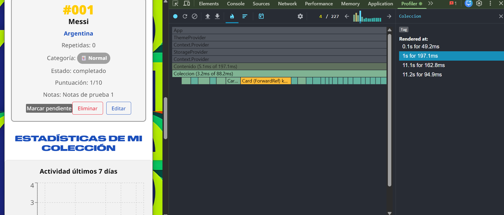
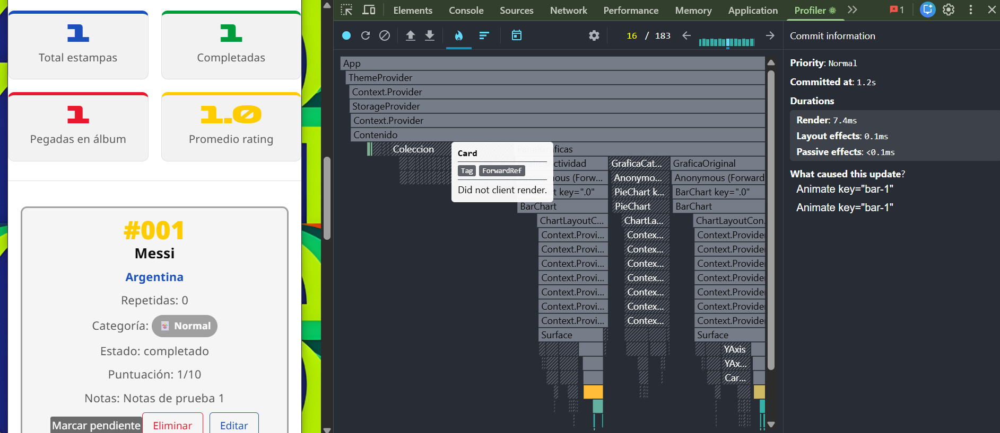

# Estampas del Mundial 2026 ⚽

## Descripción
Aplicación web para gestionar una colección de estampas del Mundial 2026. 
Permite registrar, editar y archivar estampas con información como el jugador, selección, categoría, si ya está pegada en el álbum o si se tiene repetida. 

## Tecnologías utilizadas
- Frontend: React + Vite
- Backend: Node.js + Express
- Base de datos: SQLite (better-sqlite3)
- Persistencia local: LocalStorage

## Cómo correr el proyecto

### Frontend
```bash
cd frontend
npm install
npm run dev
```
Abre http://localhost:5173 en el navegador.

### Backend
```bash
cd backend
npm install
node src/index.js
```
El servidor corre en http://localhost:3000.

## Endpoints disponibles
| Verbo | Ruta | Descripción |
|---|---|---|
| GET | /api/items | Devuelve todas las estampas activas |
| POST | /api/items | Crea una estampa nueva |
| PUT | /api/items/:id | Actualiza una estampa |
| DELETE | /api/items/:id | Archiva una estampa |
| POST | /api/items/:id/registro | Crea un registro de actividad |
___

## Mis primeros Items
A continuación se muestran las primeras estampas reales registradas en la aplicación:


___

## Mi paleta de colores

La paleta se inspira en la identidad visual oficial de la FIFA World Cup 2026:
azul, rojo, verde y amarillo. Cada variable se define dos veces, una para el
tema claro y otra para el tema oscuro.

### Tema claro
| Variable          | Hex       | Justificación |
|-------------------|-----------|---------------|
| --color-bg        | #FFFFFF   | Se eligió un fondo blanco porque da claridad y mejora la lectura del contenido. Además, permite que los colores principales del tema resalten fácilmente. |
| --color-surface   | #F2F2F2   | Ayuda a diferenciar tarjetas y formularios del fondo principal sin generar un contraste demasiado fuerte. Este gris claro crea una jerarquía visual sutil que guía al usuario sin distraerlo del contenido. |
| --color-primary   | #1B4FBB   | Se tomó como referencia de los colores asociados a la FIFA y al Mundial. Se usa como color principal en títulos y elementos importantes de la interfaz. |
| --color-accent    | #E8192C   | Se utiliza para botones y acciones importantes porque llama la atención del usuario de forma rápida. Este rojo también está presente en la identidad gráfica oficial del Mundial 2026, lo que refuerza la coherencia visual del proyecto. |
| --color-success   | #009B3A   | Representa estados positivos o tareas completadas y se relaciona fácilmente con el contexto del fútbol y la cancha. Este verde también diferencia visualmente el chip de "Pegada en el álbum" del resto de los controles del formulario. |
| --color-warn      | #FFCC00   | Se eligió para advertencias o tareas pendientes porque destaca visualmente y se asocia con atención o precaución. Además, este amarillo aparece en varios escudos y uniformes de selecciones participantes, lo que lo integra temáticamente al proyecto. |

### Tema oscuro
| Variable          | Hex       | Justificación |
|-------------------|-----------|---------------|
| --color-bg        | #0D0D0D   | Se eligió un fondo oscuro para reducir la fatiga visual y dar una apariencia más moderna a la interfaz. Este negro casi puro maximiza el contraste con el texto claro y disminuye el consumo energético en pantallas OLED. |
| --color-surface   | #1A1A1A   | Permite diferenciar las tarjetas y formularios del fondo sin perder la estética del tema oscuro. El ligero contraste con el fondo principal crea profundidad visual sin recurrir a colores llamativos. |
| --color-primary   | #5A80E0   | Azul aclarado respecto al tema claro para mantener una buena visibilidad sobre fondos oscuros. El incremento de luminosidad garantiza que los títulos y enlaces sigan siendo legibles sin saturar la vista. |
| --color-accent    | #FF4D5E   | Rojo más brillante para que las acciones principales sigan destacando correctamente en el modo oscuro. Este ajuste compensa la menor reflectancia del fondo oscuro y mantiene la jerarquía visual del tema claro. |
| --color-success   | #33C96A   | Este verde mantiene buena visibilidad en fondos oscuros y sigue representando acciones exitosas o completadas. Su tono más vivo respecto al tema claro compensa la absorción de luz del fondo oscuro. |
| --color-warn      | #FFD740   | Amarillo ligeramente más cálido que el del tema claro para que las advertencias sean fáciles de identificar dentro del modo oscuro. El cambio de tono evita el efecto de "lavado" que produce el amarillo puro sobre superficies muy oscuras. |

## Cómo probar los atajos de teclado

| Atajo  | Acción                           | Nota |
|--------|----------------------------------|------|
| Ctrl+N | Enfocar el campo de nombre       | Requiere abrir la app en modo aplicación para evitar conflicto con Chrome: `"C:\Program Files\Google\Chrome\Application\chrome.exe" --app=http://localhost:5173` |
| T      | Alternar entre tema claro/oscuro | Funciona directamente en el navegador |
___

## Medición con React DevTools Profiler

### Capturas

**Antes de la optimización**


**Después de la optimización** 


### Análisis

Antes de la optimización, escribir una sola letra en el buscador disparaba el
re-render de los 25 Cards, aunque ninguno de ellos hubiera cambiado. Esto ocurría
porque `listaFiltrada` se recalculaba en cada render de `Contenido` produciendo una
nueva referencia de array, y los handlers `onEliminar` y `onCambiarEstado` también
se recreaban, lo que hacía que `React.memo` no pudiera comparar las props
correctamente. Después de envolver `Card` con `React.memo`, memoizar `listaFiltrada`
con `useMemo` y estabilizar los handlers con `useCallback`, los Cards reciben
exactamente las mismas referencias de props entre renders y React los omite por
completo, reduciendo el tiempo de commit de ~197 ms a ~3 ms por pulsación de tecla.

## Mi gráfica original

La tercera gráfica es un BarChart horizontal que muestra
el top 5 de selecciones nacionales con más estampas en mi colección. Agrupa los
items por `atributos.seleccion`, cuenta cuántos hay por selección, ordena
descendente y se queda con las 5 primeras.

**Por qué la elegí para el tema del álbum del Mundial 2026**: el álbum se completa
por selecciones, no por categorías visuales. Saber qué selecciones tengo más
avanzadas me dice cuáles puedo terminar pronto y, por contraste, qué
selecciones casi no aparecen me indica dónde tengo que enfocarme para no quedarme
atorada al final con países difíciles de conseguir.

## Mis 3 decisiones técnicas

### (1) Estructura del reducer
Separé las acciones en tres grupos: hidratación (`HIDRATAR`), mutaciones sobre la
lista (`AGREGAR`, `ELIMINAR`, `CAMBIAR_ESTADO`, `REGISTRAR_ACTIVIDAD`) y filtros
(`FILTRAR`, `LIMPIAR_FILTROS`). `FILTRAR` recibe `{ campo, valor }` en lugar de
crear una acción por cada filtro, ya que esto evita repetir tres acciones casi idénticas
y mantiene el `switch` corto.

### (2) Acción más difícil
`ELIMINAR` fue la más compleja porque la rúbrica pide *soft delete* (`activo=false`)
y no remover del array. Si lo eliminaba físicamente, perdía datos al recargar y la
gráfica de actividad no podía mostrar histórico. Lo resolví usando `.map()` para
clonar la lista y solo voltear `activo` del item afectado permitiendo restaurar items en el futuro.

### (3) Gráfica más compleja
La `GraficaActividad` fue la más laborosa porque tiene que rellenar días vacíos
con cero. Construyo primero un arreglo base de 7 días con `cantidad: 0` usando
`new Date()` y `setDate(hoy - i)`, luego recorro `listaFiltrada` y sumo +1 al día
que coincide con `fechaRegistro`. Esto garantiza que la barra de un día
sin registros aparezca como hueco visible y no se "salte" del eje X.
